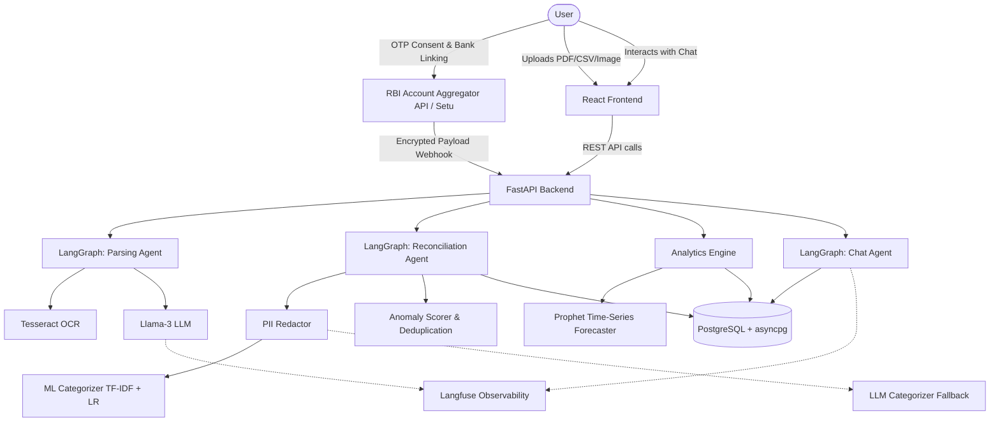

# Personal Finance Assistant (AI/ML Full-Stack Application)

<div align="center">
  
</div>

Welcome to my Personal Finance Assistant! I built this project to help solve a problem I was facing: keeping track of my expenses across different bank accounts, receipts, and statements without manually entering every single detail. 

Under the hood, it uses a custom Machine Learning pipeline, Llama-3, and India's **RBI Account Aggregator (AA) framework** to automatically sync live bank accounts, categorize transactions, scrub PII, read PDF/image receipts, and forecast cash flow for the next 30 days using Meta's Prophet model.

## Screenshots

### Dashboard & Analytics
| Dashboard & AI Quick Add | Monthly Cash Flow & Forecast |
| :---: | :---: |
|  |  |
| *The main dashboard featuring real-time financial health scores and NLP Quick Add.* | *Grouped monthly cash flow trends and a 30-day Prophet time-series forecast.* |

| Financial Saving Goals | AI Insights & Category Breakdown |
| :---: | :---: |
|  |  |
| *Tracking progress against custom savings targets with dynamic progress bars.* | *Category spending distribution and AI-generated financial health coaching.* |

### Live Bank Connections & RBI Account Aggregator Flow
| Bank Connections Dashboard | Bank Selection & Mobile Entry |
| :---: | :---: |
|  |  |
| *The unified imports hub featuring RBI Account Aggregator sync, file upload, and manual entry.* | *Selecting from Indian banks (HDFC, SBI, ICICI, Axis) and entering registered phone numbers.* |

| Authorize AA Consent via OTP | Human-in-the-Loop (HITL) Review Queue |
| :---: | :---: |
|  |  |
| *Entering the 6-digit OTP to grant read-only statement access to the assistant.* | *Review queue for approving or rejecting transactions flagged as duplicates or high-value anomalies.* |

### Transaction History & Manual Imports
| Transaction History Ledger | Statement File Uploader |
| :---: | :---: |
|  |  |
| *Searchable and sortable transaction ledger formatted in dd/mm/yyyy date format.* | *Drag-and-drop file upload for processing CSVs, PDFs, or Image receipts via Tesseract OCR.* |

## Key Features
- **RBI Account Aggregator (AA) Live Bank Sync**: Connect Indian bank accounts (HDFC, SBI, ICICI, Axis Bank) via an end-to-end encrypted Open Banking API framework using OTP authorization.
- **Multi-modal Parsing**: Upload CSV, PDF, or Images. Uses `Tesseract OCR` and a dedicated parsing LangGraph agent to extract raw transaction rows.
- **Hybrid ML/LLM Categorization**: 
  - *Primary*: A Scikit-Learn TF-IDF + Logistic Regression pipeline achieving ~86% Accuracy, ~0.80 Macro-F1 with ~0.03ms latency per transaction.
  - *Fallback*: A zero-shot Llama-3 LLM categorizer using Groq.
- **Intelligent Reconciliation & Anomaly Detection**: LangGraph workflow deduplicates transactions across accounts and flags anomalies (e.g., duplicate charges or transactions > ₹30,000 INR), placing them in a Human-in-the-loop (HITL) review queue.
- **Cash-flow Forecasting**: Uses Meta's `Prophet` time-series model to forecast the next 30 days of income and expenses, surfaced on the dashboard.
- **Privacy & Security First**: A dedicated `PII_Redactor` strips Credit Card numbers, SSNs, and Phone Numbers via regex before any text hits the LLM boundary.
- **Observability & Evals**: Integrated with `Langfuse` to trace LLM calls. A standalone evaluation harness (`eval/run_evals.py`) benchmarks models against synthetic ground truth datasets.
- **Interactive Chatbot**: RAG-style interactive agent that can answer natural language questions about your transaction history and goals.

## Architecture



## Technology Stack
- **Backend**: FastAPI, SQLAlchemy (asyncpg), PostgreSQL, Pydantic
- **Frontend**: React, Vite, Recharts, Lucide Icons
- **Banking Integration**: RBI Account Aggregator Framework (Setu / Open Banking APIs)
- **AI/ML**: LangGraph, Langchain, Scikit-Learn, Prophet, Tesseract OCR, Llama-3 (Groq API)
- **DevOps**: Docker, Docker Compose, Pytest
- **Observability**: Langfuse

## How to Run Locally

### 1. Prerequisites
- Docker & Docker Compose
- Python 3.10+
- Tesseract OCR (`brew install tesseract` or `apt-get install tesseract-ocr`)

### 2. Environment Variables
Create a `.env` file in `backend/` and `frontend/`:
```env
# backend/.env
DATABASE_URL=postgresql+asyncpg://user:password@db:5432/finance
GROQ_API_KEY=your_groq_api_key
LANGFUSE_PUBLIC_KEY=optional_langfuse_pk
LANGFUSE_SECRET_KEY=optional_langfuse_sk
USE_ML_CATEGORIZER=true

# frontend/.env
BACKEND_URL=http://backend:8000
```

### 3. Start with Docker Compose
```bash
docker-compose up --build
```
- Frontend available at `http://localhost:5173`
- Backend API docs at `http://localhost:8000/docs`

### 4. Running the ML Evaluation Harness
```bash
python -m venv venv
source venv/bin/activate
pip install -r backend/requirements.txt
python eval/run_evals.py
```

## Repository Structure
- `/backend`: Core FastAPI app (`routes_bank_sync.py`, `routes_upload.py`), LangGraph agents, ML services, database models, and unit tests.
- `/frontend`: React dashboard, bank sync consent modal, statement upload interfaces, and NLP UI.
- `/eval`: Evaluation harness and benchmarking results.
- `/scripts`: Data synthesis and model training scripts.
- `/data`: Synthetic training data.

## License
MIT License
