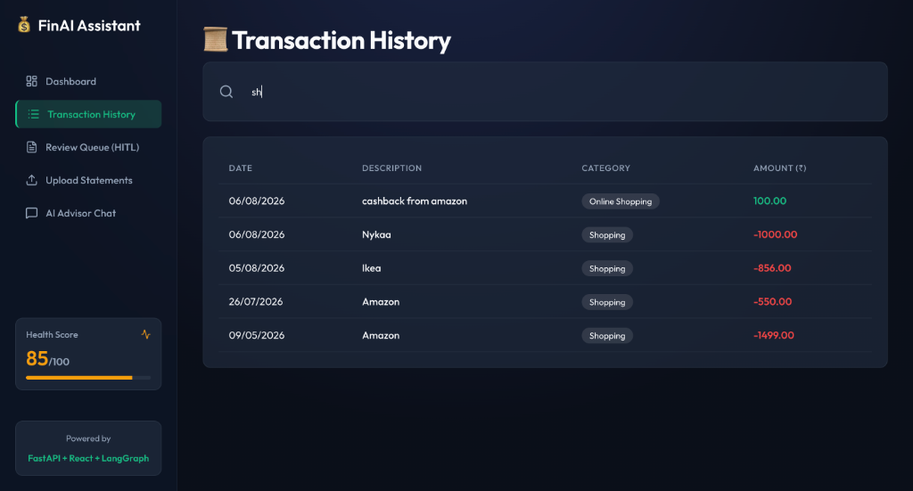
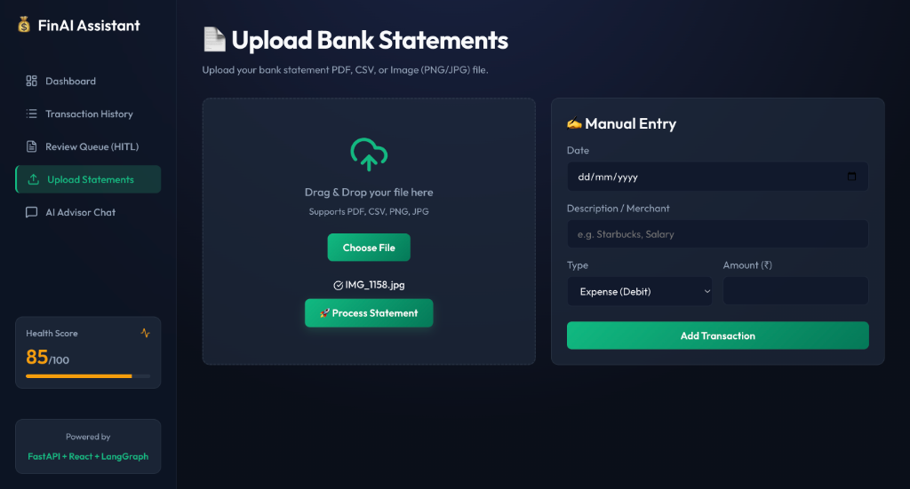
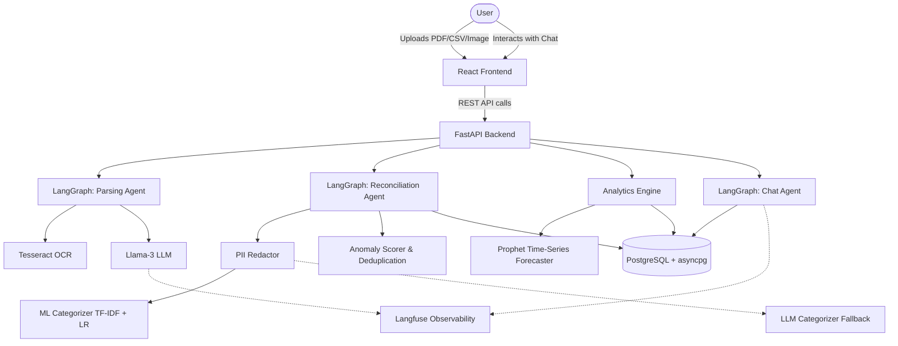

# Personal Finance Assistant (AI/ML Full-Stack Application)

<div align="center">
  
</div>

Welcome to my Personal Finance Assistant! I built this project to help solve a problem I was facing: keeping track of my expenses across different accounts, receipts, and bank statements without manually entering every single detail. 

Under the hood, it uses a custom Machine Learning pipeline and Llama-3 to automatically categorize transactions, read messy PDF statements, and even forecast my cash flow for the next 30 days using Meta's Prophet model. I also built a natural language "Quick Add" feature so I can just type things like "spent 15 bucks at starbucks" and have it instantly logged and categorized correctly.

## Screenshots

Here's a quick look at the application in action:

| Dashboard & AI Quick Add | Cash Flow & Forecast |
| :---: | :---: |
|  |  |
| *The main dashboard featuring the NLP Quick Add input for logging transactions in natural language.* | *Interactive cash flow visualizations and a 30-day Prophet time-series forecast.* |

| Financial Saving Goals | Insights Report |
| :---: | :---: |
|  |  |
| *Tracking progress against custom financial goals with dynamic progress bars.* | *AI-generated insights summarizing spending patterns and anomalies.* |

| Transaction History | Upload Statements & Manual Entry |
| :---: | :---: |
|  |  |
| *A searchable, sortable ledger of all processed transactions with formatted dates.* | *The drag-and-drop interface for parsing raw CSVs, PDFs, or Image receipts.* |

## Key Features
- **Multi-modal Parsing**: Upload CSV, PDF, or Images. Uses `Tesseract OCR` and a dedicated parsing LangGraph agent to extract raw transaction rows.
- **Hybrid ML/LLM Categorization**: 
  - *Primary*: A Scikit-Learn TF-IDF + Logistic Regression pipeline achieving ~86% Accuracy, ~0.80 Macro-F1 with ~0.03ms latency per transaction.
  - *Fallback*: A zero-shot Llama-3 LLM categorizer using Groq.
- **Intelligent Reconciliation & Anomaly Detection**: LangGraph workflow deduplicates transactions across uploads and scores anomalies (e.g., unusually high spending or duplicated transactions), placing them in a Human-in-the-loop (HITL) review queue.
- **Cash-flow Forecasting**: Uses Meta's `Prophet` time-series model to forecast the next 30 days of income and expenses, surfaced on the dashboard.
- **Privacy & Security First**: A dedicated `PII_Redactor` strips Credit Card numbers, SSNs, and Phone Numbers via regex before any text hits the LLM boundary.
- **Observability & Evals**: Integrated with `Langfuse` to trace LLM calls. A standalone evaluation harness (`eval/run_evals.py`) benchmarks models against synthetic ground truth datasets.
- **Interactive Chatbot**: RAG-style interactive agent that can answer natural language questions about your transaction history and goals.

## Architecture



## Technology Stack
- **Backend**: FastAPI, SQLAlchemy (asyncpg), PostgreSQL, Pydantic
- **Frontend**: React, Vite, Recharts, Lucide Icons
- **AI/ML**: LangGraph, Langchain, Scikit-Learn, Prophet, Tesseract OCR, Llama-3 (Groq API)
- **DevOps**: Docker, Docker Compose, Pytest
- **Observability**: Langfuse

## How to Run Locally

### 1. Prerequisites
- Docker & Docker Compose
- Python 3.10+
- Tesseract OCR (`brew install tesseract` or `apt-get install tesseract-ocr`)

### 2. Environment Variables
Create a `.env` file in `backend/` and `frontend/`:
```env
# backend/.env
DATABASE_URL=postgresql+asyncpg://user:password@db:5432/finance
GROQ_API_KEY=your_groq_api_key
LANGFUSE_PUBLIC_KEY=optional_langfuse_pk
LANGFUSE_SECRET_KEY=optional_langfuse_sk
USE_ML_CATEGORIZER=true

# frontend/.env
BACKEND_URL=http://backend:8000
```

### 3. Start with Docker Compose
```bash
docker-compose up --build
```
- Frontend available at `http://localhost:5173`
- Backend API docs at `http://localhost:8000/docs`

### 4. Running the ML Evaluation Harness
```bash
python -m venv venv
source venv/bin/activate
pip install -r backend/requirements.txt
python eval/run_evals.py
```

## Repository Structure
- `/backend`: Core FastAPI app, LangGraph agents, ML services, database models, and unit tests.
- `/frontend`: React dashboard, upload interfaces, and NLP UI.
- `/eval`: Evaluation harness and benchmarking results.
- `/scripts`: Data synthesis and model training scripts.
- `/data`: Synthetic training data.

## License
MIT License
